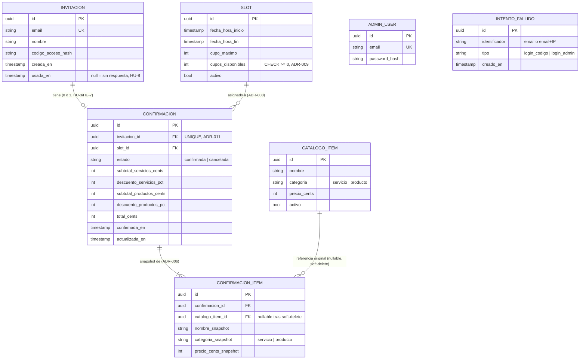
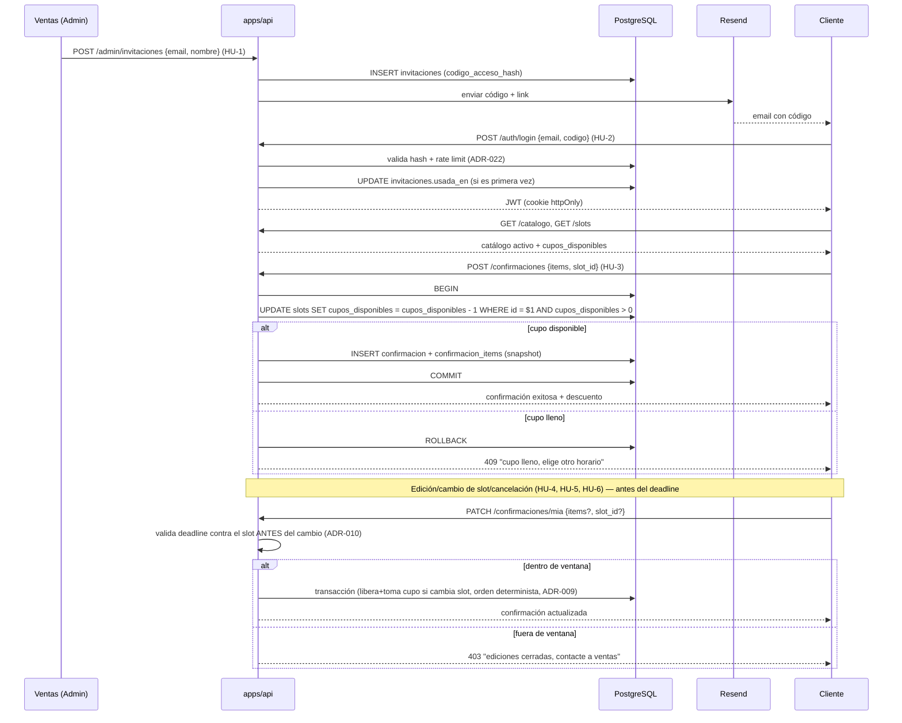
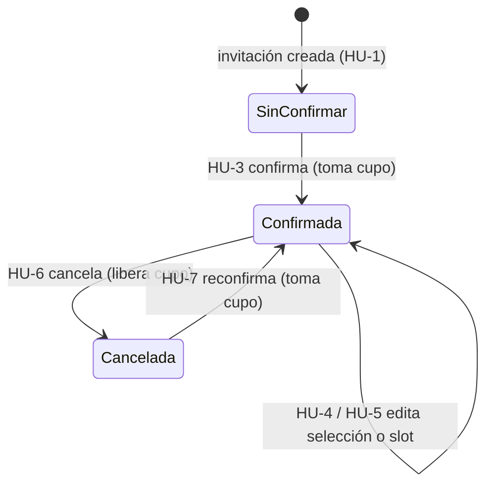
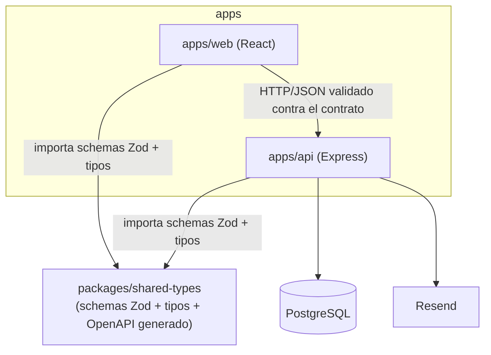

# Especificación Funcional — Plataforma de Confirmación de Asistencia (Feria de Promociones)

> Versión: 1.0 | Fecha: 2026-09-16
> Ver `DECISIONES_ARQUITECTURA.md` para el "por qué" de cada regla citada aquí (ADR-XXX) y `PLAN_DESARROLLO.md` para en qué gate se implementa cada historia.
> Formato de historias de usuario y estructura del documento: mismo convenio que `spec-mezcla.md` (APCA).

---

## 1. Contexto y Objetivos

El departamento de ventas organiza un evento anual de promociones. Los clientes deben poder confirmar su asistencia y declarar los servicios/productos de su interés **antes** del evento, para que ventas prepare un portafolio de promociones personalizado por cliente. La plataforma:

- No admite confirmaciones anónimas — todo cliente es invitado previamente por ventas (ADR-011).
- Calcula descuentos automáticos por categoría (servicios / productos) según reglas de umbral (ADR-004, ADR-005).
- Administra un evento con múltiples slots (día/horario) con cupo limitado (ADR-008, ADR-009).
- Permite editar/cancelar/reconfirmar antes de un deadline configurable (ADR-010).

**No-objetivos** (fuera de alcance de esta entrega): múltiples eventos simultáneos, múltiples roles de ventas con permisos diferenciados, e2e de UI, diseño para 300k usuarios concurrentes (ver ADR-019).

---

## 2. Roles y Matriz de Permisos

| Rol | Cómo se identifica | Alcance |
|---|---|---|
| **Cliente invitado** | Email + código de acceso de 6 dígitos (ADR-011) | Solo su propia invitación/confirmación — nunca ve datos de otros clientes |
| **Ventas (Admin)** | Email + password, cuenta seed única (ADR-013) | Todas las invitaciones, confirmaciones, catálogo, slots y configuración |

| Acción | Cliente invitado | Ventas (Admin) |
|---|:-:|:-:|
| Ver catálogo/slots activos | ✅ (tras login) | ✅ |
| Confirmar asistencia (primera vez) | ✅ (HU-3) | ❌ |
| Editar selección antes del deadline | ✅ solo la propia (HU-4) | ❌ |
| Cambiar de slot antes del deadline | ✅ solo la propia (HU-5) | ❌ |
| Cancelar / reconfirmar | ✅ solo la propia (HU-6, HU-7) | ❌ |
| Crear invitación | ❌ | ✅ (HU-1) |
| Reenviar código de acceso | ❌ | ✅ (HU-11) |
| Ver/exportar todas las confirmaciones | ❌ | ✅ (HU-8) |
| CRUD catálogo (soft-delete) | ❌ | ✅ (HU-9) |
| CRUD slots + cupo + deadline (N días) | ❌ | ✅ (HU-10) |

No hay rol "público" ni "anónimo" en ninguna pantalla — ambos roles requieren autenticación propia desde el primer acceso.

---

## 3. Historias de Usuario y Criterios de Aceptación

### HU-1: Ventas invita a un cliente

**Como** miembro del equipo de ventas
**Quiero** registrar el email (y opcionalmente nombre) de un cliente e invitarlo
**Para** que reciba su código de acceso y pueda confirmar su participación

**Criterios de aceptación**:
- [ ] Formulario con email (requerido) y nombre/apellidos (opcional)
- [ ] Al guardar, se genera un código de 6 dígitos numéricos (ADR-011), se hashea (`codigo_acceso_hash`) y nunca se guarda en texto plano
- [ ] Se envía email vía Resend con el código y el link a la plataforma (ADR-015)
- [ ] Si el email ya tiene invitación activa, no se crea una duplicada — se ofrece reenviar el código (HU-11)
- [ ] La invitación queda "sin respuesta" (`usada_en IS NULL`) hasta el primer login exitoso del cliente

### HU-2: Cliente inicia sesión con su código

**Como** cliente invitado
**Quiero** ingresar mi email y el código que recibí por correo
**Para** acceder a mi formulario de confirmación de asistencia

**Criterios de aceptación**:
- [ ] Email pre-llenado si se accede desde el link del correo
- [ ] Email+código correctos → JWT en cookie httpOnly; se registra `invitaciones.usada_en` si es el primer login
- [ ] Máximo 5 intentos fallidos en 15 minutos, contados **por email Y por IP de forma independiente** — cualquiera de los dos contadores al llegar al límite bloquea el intento (evita que un atacante rote de IP para seguir probando contra el mismo email, ADR-022)
- [ ] Código inválido/expirado muestra mensaje genérico, sin revelar si el email existe (no enumeration)
- [ ] Sin invitación previa para ese email, el login se rechaza — no existe ruta de acceso sin invitación (ADR-011)

### HU-3: Cliente confirma su asistencia por primera vez

**Como** cliente invitado ya autenticado
**Quiero** seleccionar los servicios/productos de mi interés y mi horario de asistencia
**Para** confirmar mi participación y conocer el descuento que obtengo

**Criterios de aceptación**:
- [ ] Email de solo lectura (identidad ya autenticada); nombre/apellidos editable (ADR-011)
- [ ] Catálogo activo se carga una vez; el buscador filtra en memoria, sin llamadas por tecleo (ADR-012)
- [ ] Dos cajas en vivo, "Servicios seleccionados" / "Productos seleccionados", con opción de quitar cada ítem (ADR-004)
- [ ] Cada caja muestra su % de descuento en vivo (preview cliente, no autoritativo)
- [ ] Selector de slot con cupos disponibles visibles (informativo, no autoritativo)
- [ ] Al confirmar, el servidor recalcula el descuento — nunca confía en el valor mostrado en el cliente
- [ ] Por categoría, se evalúa primero la condición de 5%, luego 3% — tier más alto gana (ADR-005)
- [ ] Suma exactamente Q.1,500.00 en servicios **no** califica para 5% (frontera estricta, ADR-005)
- [ ] Confirmar toma el cupo del slot de forma atómica (`UPDATE ... WHERE cupos_disponibles > 0`); si ya no hay cupo, se rechaza y el cliente elige otro (ADR-009)
- [ ] Se guarda snapshot de nombre/precio/categoría de cada ítem y el % resultante (ADR-006)
- [ ] `confirmaciones.invitacion_id` es `UNIQUE` — esta es la única confirmación posible para esa invitación (ADR-011)
- [ ] Requiere al menos 1 ítem seleccionado (servicio o producto) — una confirmación con selección vacía se rechaza (400), validado en el schema Zod compartido (G0)
- [ ] `POST /confirmaciones` se rechaza con 409 si ya existe una confirmación en estado `confirmada` para esa invitación (ese caso es HU-4/HU-5 vía `PATCH`, no un segundo `POST`)

### HU-4: Cliente edita su selección antes del deadline

**Como** cliente ya confirmado
**Quiero** modificar los servicios/productos que elegí
**Para** ajustar mi selección antes de que cierre la ventana de edición

**Criterios de aceptación**:
- [ ] Solo posible si `ahora < (slot_actual.fecha_hora_inicio − N días)`, evaluado contra el slot que tenía **antes** de cualquier cambio (ADR-010)
- [ ] Fuera de la ventana: mensaje "ediciones no permitidas, comuníquese al departamento de ventas al [teléfono ficticio]", sin aplicar ningún cambio
- [ ] El descuento se recalcula con las mismas reglas de HU-3, nuevo snapshot al guardar
- [ ] Si la confirmación está en estado `cancelada`, `PATCH /confirmaciones/mia` rechaza con 409 y remite a HU-7 (reconfirmar) — editar y reconfirmar son operaciones distintas

### HU-5: Cliente cambia de slot al editar

**Como** cliente ya confirmado
**Quiero** cambiar el día/horario al que voy a asistir
**Para** ajustar mi asistencia a un horario que me convenga mejor

**Criterios de aceptación**:
- [ ] Sujeto a la misma ventana de edición que HU-4
- [ ] Transacción única: libera cupo del slot viejo (+1), toma cupo del nuevo (−1 con `WHERE > 0`); locks en orden determinista por `id` de slot ascendente (ADR-009)
- [ ] Slot destino lleno → se revierte todo, el cliente conserva su slot original, mensaje claro de cupo lleno
- [ ] La elegibilidad de edición se evalúa contra el slot **antes** del cambio, nunca el nuevo (ADR-010)

### HU-6: Cliente cancela su asistencia

**Como** cliente ya confirmado
**Quiero** cancelar mi asistencia
**Para** liberar mi cupo si ya no puedo/quiero asistir

**Criterios de aceptación**:
- [ ] Solo dentro de la misma ventana de edición que HU-4
- [ ] Libera el cupo del slot (+1) en la misma transacción, marca `estado = 'cancelada'`
- [ ] No se borra la fila — el snapshot se conserva para el historial de ventas (ADR-006, ADR-009)

### HU-7: Cliente reconfirma después de cancelar

**Como** cliente que canceló previamente
**Quiero** volver a confirmar mi asistencia con mi mismo código
**Para** participar en la feria si cambio de opinión

**Criterios de aceptación**:
- [ ] El código sigue vigente — vive mientras viva la invitación, no expira al cancelar (ADR-011)
- [ ] Reconfirmar reutiliza la misma fila (`invitacion_id` UNIQUE) — nunca crea una segunda confirmación
- [ ] Toma cupo con un `-1` fresco (`WHERE cupos_disponibles > 0`); si el slot original ya no tiene cupo, debe elegir otro
- [ ] `estado` vuelve a `confirmada`, snapshot se sobrescribe con la nueva selección

### HU-8: Ventas consulta y exporta las confirmaciones

**Como** miembro del equipo de ventas
**Quiero** ver todas las confirmaciones (incluyendo quiénes no han respondido) con su selección y descuento
**Para** preparar el portafolio de promociones personalizado de cada cliente

**Criterios de aceptación**:
- [ ] Listado filtrable por estado: confirmada / cancelada / sin respuesta (`invitaciones.usada_en IS NULL`) — esto le da propósito al campo `usada_en`, que de otro modo no tendría ninguna historia que lo use
- [ ] Exporta CSV con columnas fijas: nombre, apellidos, email, slot, servicios, productos, subtotal servicios, % descuento servicios, subtotal productos, % descuento productos, total, estado (ADR-013)
- [ ] Los datos exportados son el snapshot congelado (ADR-006), no un recálculo contra el catálogo actual

### HU-9: Ventas gestiona el catálogo

**Como** miembro del equipo de ventas
**Quiero** crear, editar y desactivar servicios/productos
**Para** mantener actualizada la oferta de la feria

**Criterios de aceptación**:
- [ ] CRUD con soft-delete (`activo = false`, nunca borrado físico, ADR-007)
- [ ] Un ítem desactivado deja de aparecer en el formulario del cliente pero sigue íntegro en confirmaciones ya hechas (vía snapshot)
- [ ] Editar el precio de un ítem no afecta confirmaciones ya hechas (ADR-006)

### HU-10: Ventas gestiona los slots del evento

**Como** miembro del equipo de ventas
**Quiero** crear slots (día/horario/cupo) y configurar el deadline de edición
**Para** organizar la logística del evento y controlar cuánto tiempo antes se cierran las ediciones

**Criterios de aceptación**:
- [ ] CRUD con soft-delete, igual que catálogo (ADR-007)
- [ ] Si se reduce `cupo_maximo` por debajo de las reservas actuales, se rechaza con error explícito (ADR-009)
- [ ] El N de días de deadline es configurable y se aplica a cada confirmación según su propio slot (ADR-010)

### HU-11: Ventas reenvía un código de acceso

**Como** miembro del equipo de ventas
**Quiero** reenviar el código de acceso a un cliente ya invitado
**Para** el caso de que no lo recibió o lo perdió

**Criterios de aceptación**:
- [ ] Reenvía el **mismo** código (no genera uno nuevo) — no invalida sesiones que el cliente ya esté usando
- [ ] Disponible solo para invitaciones existentes, mismo botón/pantalla que HU-1

---

## 4. Modelo de Datos

**Notas de representación**:
- `descuento_servicios_pct` / `descuento_productos_pct` son enteros de **porcentaje entero** (0, 3 o 5 — no basis points, no decimales).
- `total_cents` se **almacena como parte del snapshot** al confirmar (ADR-006) — no se recalcula al leer, igual que el resto de la fila.
- Redondeo: al aplicar el % de descuento sobre un subtotal en centavos, se redondea al centavo más cercano con **"round half up"** (ej. 3% de Q.333.33 = 9.9999 centavos de descuento → redondea a 10). Se fija esta regla explícitamente porque un `total_cents` que no coincide en pruebas por 1 centavo es el tipo de defecto que un test de integración detecta tarde si la regla no está escrita de antemano.

---

## 5. Flujo Completo (Secuencia)

---

## 6. Estados de una Confirmación

`SinConfirmar` no es una fila en `confirmaciones` — es la ausencia de una (invitación sin confirmación asociada), visible en HU-8 como "sin respuesta".

---

## 7. Arquitectura del Contrato (referencia rápida — ver ADR-002/003/020/021)

**Corrección a ADR-003 (ratificada)**: los schemas Zod viven en `packages/shared-types` (no en `apps/api`), porque `apps/web` los necesita como objetos reales para validar formularios con React Hook Form (ADR-016) — un app no debe depender de otro app. `apps/api` sigue siendo quien los usa para validar request/response, y de ahí se genera el OpenAPI; el cambio es solo dónde vive el archivo fuente. Ver ADR-003 actualizada en `DECISIONES_ARQUITECTURA.md`.

---

## 8. Endpoints (derivados de las historias — contrato real se genera de los schemas Zod, G0)

| Método | Ruta | Historia | Rol |
|---|---|---|---|
| POST | `/admin/auth/login` | — | Ventas |
| POST | `/admin/invitaciones` | HU-1 | Ventas |
| POST | `/admin/invitaciones/:id/reenviar` | HU-11 | Ventas |
| GET | `/admin/confirmaciones` | HU-8 | Ventas |
| GET | `/admin/confirmaciones/export.csv` | HU-8 | Ventas |
| CRUD | `/admin/catalogo` | HU-9 | Ventas |
| CRUD | `/admin/slots` | HU-10 | Ventas |
| GET/PATCH | `/admin/configuracion` (N días deadline) | HU-10 | Ventas |
| POST | `/auth/login` | HU-2 | Cliente |
| GET | `/catalogo` | HU-3 | Cliente |
| GET | `/slots` | HU-3 | Cliente |
| POST | `/confirmaciones` | HU-3, HU-7 | Cliente |
| PATCH | `/confirmaciones/mia` | HU-4, HU-5 | Cliente |
| POST | `/confirmaciones/mia/cancelar` | HU-6 | Cliente |

---

## 9. Riesgos

- **Deadline mal configurado (N=0 o negativo)**: el admin panel debe validar N ≥ 0 al guardar configuración (HU-10) — un N negativo abriría edición después del evento.
- **Email de invitación no entregado**: sin reintentos automáticos de envío en esta entrega; HU-11 (reenviar) es la mitigación manual.
- **Confusión "sin respuesta" vs "cancelada"**: ambas dejan la invitación sin cupo tomado, pero solo "cancelada" tuvo una confirmación previa — el filtro de HU-8 debe distinguirlas explícitamente, nunca agruparlas como "inactivas".
